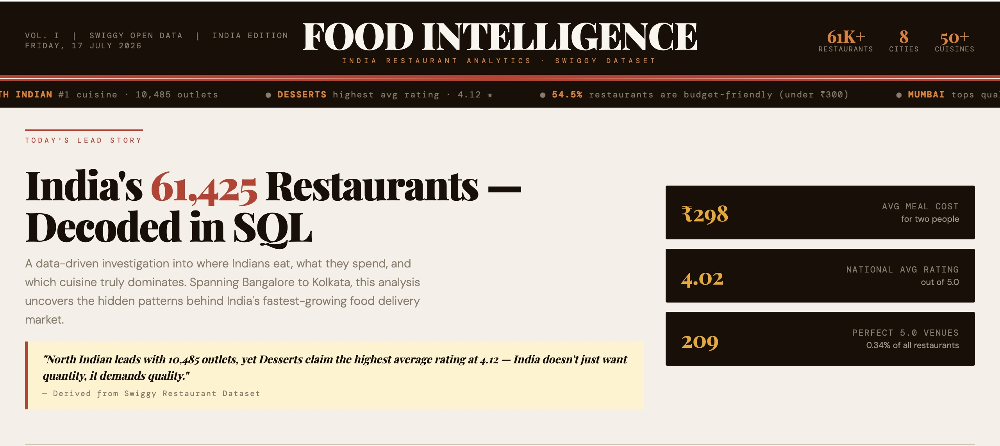
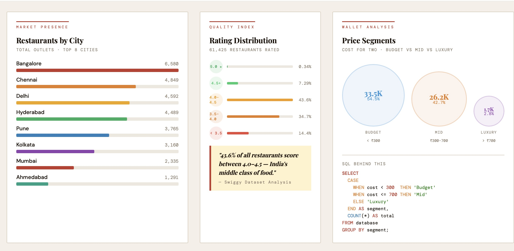
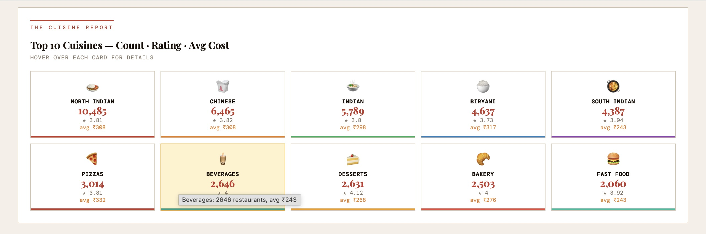
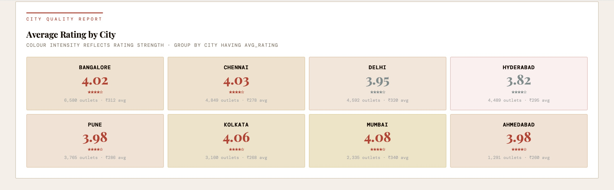
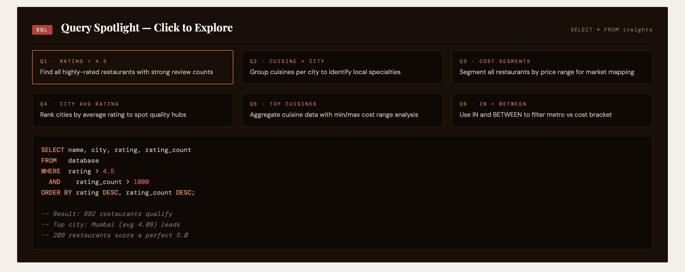
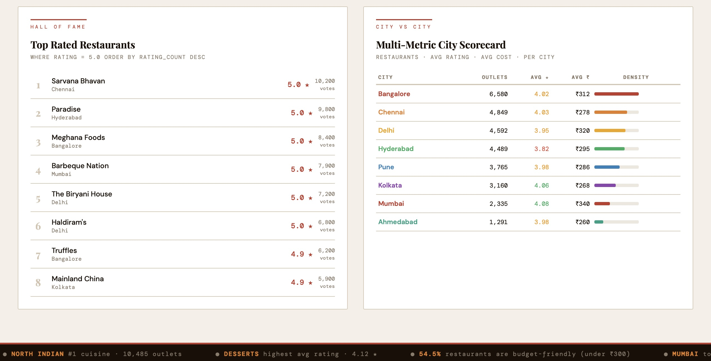

# Swiggy Restaurant Market Analysis & Dashboard

**An end-to-end analysis of 61,425 restaurants across 8 Indian cities — from a single raw CSV export to a queryable dataset and a decision-ready dashboard.**

---

## 1. The Problem

Swiggy's public restaurant listings data is exactly what it sounds like: a flat export of every restaurant on the platform — name, city, rating, rating count, cuisine, cost for two — with no structure imposed on top of it. On its own, a spreadsheet like that answers almost nothing. You can't tell a category manager which cities are underperforming on quality, which cuisines are oversaturated versus under-served, or where the real "budget vs. premium" split actually sits, just by scrolling 61K rows.

The goal of this project was to turn that flat export into something a city ops lead or a cuisine category manager could actually query and act on — a proper SQL layer for analysis, plus a single dashboard that surfaces the findings without anyone having to write a query themselves.

## 2. The Data

One raw source, 61,425 rows:

| Column | What it holds |
|---|---|
| `id` | Unique restaurant ID |
| `name` | Restaurant name |
| `city` | City of operation (8 cities total) |
| `rating` | Customer rating, out of 5.0 |
| `rating_count` | Total number of ratings received |
| `cuisine` | Primary cuisine type |
| `cost` | Average cost for two, in ₹ |
| `link` | Swiggy listing URL |

It's a single table, but it's a deceptively rich one — cost, rating, rating volume, cuisine and city all interact with each other in ways that only show up once you start grouping and filtering.

## 3. What I Built

### a) SQL analysis (`swiggy.sql`)
I loaded the CSV into a table named `database` and worked through the analysis in layers, each one building on the last:
- **Basic retrieval and filters** — pulling records by city, by rating threshold, by budget cap.
- **Aggregations** — `COUNT`, `AVG`, `MIN`, `MAX` grouped by city and by cuisine, to get a first read on market size and price bands.
- **City intelligence** — `COUNT(DISTINCT city)`, then `GROUP BY ... HAVING` to isolate cities that clear a quality bar (avg rating > 4.5).
- **Compound filtering** — `AND` / `IN` / `BETWEEN` combinations to answer sharper questions like "which restaurants have both a strong rating *and* real engagement volume," not just one or the other.
- **Cuisine-level thresholds** — `GROUP BY ... HAVING COUNT(*) > 100` to separate cuisines that are a genuine market segment from ones that are just a handful of listings.

The file reads as a progression from simple `SELECT` statements to compound, multi-condition queries — meant to be run against any MySQL / MariaDB / SQLite instance after importing the CSV.

### b) Interactive dashboard (`swiggy_dashboard.html`)
Rather than leave the findings as query output, I built a single-page, editorial-style dashboard in pure HTML/CSS/JS — no frameworks, no build step, just open the file in a browser. It mirrors the SQL findings visually:
- A city-wise bar chart of restaurant counts
- A rating-distribution breakdown across all 61K restaurants
- A cost bubble chart for the Budget / Mid-Range / Luxury segments
- A top-10 cuisine grid with count, average rating, and average cost side by side
- A city heatmap colour-coded by rating intensity
- Six "SQL spotlight" cards — the query itself, syntax-highlighted, next to the insight it produces
- A "Hall of Fame" of top-rated restaurants by vote count
- A full city scorecard for side-by-side comparison

## 4. What the Numbers Say

- **61,425 restaurants** across **8 cities**, averaging **₹298** for a meal for two and a **4.02★** rating nationally — but only **209 restaurants** hold a perfect 5.0.
- **North Indian is the dominant cuisine by volume** (10,485 outlets), but it isn't the best-rated one — **Desserts** edges it out with a 4.12★ average, suggesting dessert spots convert satisfaction into ratings more reliably than the biggest category does.
- **Bangalore is the largest single market** (6,580 restaurants), but **Mumbai posts the highest average rating** (4.08★) despite being the smallest of the major metros by listing count — and it's also the most expensive city to eat in (₹340 avg), which reads less like "expensive food is worse" and more like a market where quality and price are both structurally higher.
- **Hyderabad is the outlier on quality**: the second-largest market by restaurant count, but the lowest average rating (3.82★) of the 8 cities — a gap worth investigating rather than assuming is noise.
- **The market is overwhelmingly budget-to-mid**: 54.5% of restaurants sit under ₹300 for two, another 42.7% fall between ₹300–₹700, and only **2.8%** clear ₹700 — luxury dining is a genuinely small slice of Swiggy's restaurant base, not a rounding error but not the market either.

## 5. Tech Stack

`SQL` (MySQL / MariaDB / SQLite-compatible) for the full analysis layer · `HTML / CSS / JavaScript` (no frameworks) for the interactive dashboard · plain `CSV` as the single source of truth.

## 6. Repo Structure

```
swiggy-analytics/
├── database.csv              # Raw dataset (61,425 restaurant records)
├── swiggy.sql                # Full SQL analysis, from basic filters to compound queries
├── swiggy_dashboard.html     # Interactive dashboard mirroring the SQL findings
└── README.md
```

## 7. How to Run It

**SQL:**
```sql
CREATE DATABASE swiggy;
USE swiggy;
-- import database.csv into a table named `database`
-- then run any query from swiggy.sql, e.g.:
SELECT name, city, rating FROM database
WHERE rating > 4.5
ORDER BY rating DESC
LIMIT 10;
```

**Dashboard:** no installation needed — just open `swiggy_dashboard.html` in any modern browser.

---

## 8. Screenshots








## 📋 Requirements

- **SQL:** MySQL 8+ / MariaDB / SQLite (any SQL-compatible engine)
- **Dashboard:** Any modern browser (Chrome, Firefox, Edge, Safari)
- **No Python, Node.js, or backend required**
- ---

## 🤝 Contributing

Pull requests are welcome. For major changes, please open an issue first to discuss what you'd like to change.

---

## 📄 License

This project is open source and available under the [MIT License](LICENSE).

---

<p align="center">Made with ❤️ and SQL · Swiggy Open Dataset · India 🇮🇳</p>
